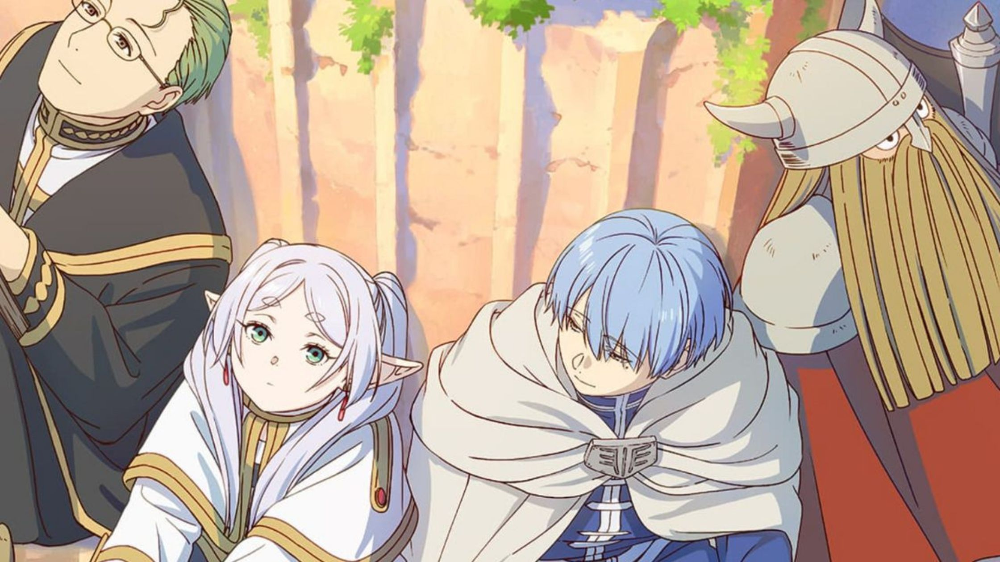

# **My Favorite Series**
## *What lies after the end of the Journey? Frieren: Beyond Journey's End*

葬送のフリーレン (Sousou no Frieren) or Frieren: Beyond Journey's End tells the story of Frieren, an elven mage that has already lived for more than a thousand years. She had the chance to fight and travel together with Himmel the Hero, Eisen the Warrior, and Heiter the Priest. Their 10-year adventure concluded as they defeated the demon king and brought peace to the continent.

Frieren: Beyond Journey's End separates itself from other animated fantasy series by shifting the main focus on what lies after the journey as Frieren encounters meaningful meetings and departures.

## List of characters:
| Character | Description |
| ----------- | ----------- |
|  | Frieren - The main protagonist of the series. An elven mage of more than a thousand years old. |
| Paragraph | Text |

1. Frieren the Mage
2. Fern
3. Stark
4. Himmel the Hero
5. Eisen the Warrior
6. Heiter the Priest
7. and many more...
